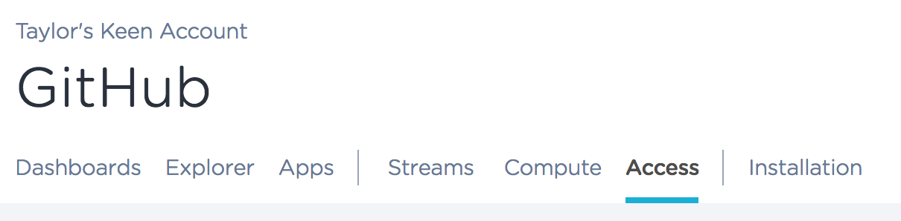
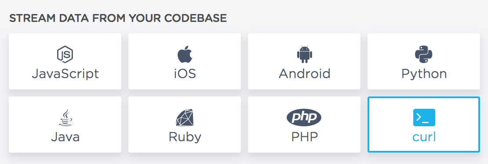

# GitHub Analytics with Keen IO

Stream event data from your GitHub repos to a Keen project via GitHub's event stream webhooks. 

[Read more about this project here](https://blog.keen.io/tracking-github-data-with-keen-io-f130bcdec545).


### Installation

Clone and install this project. NodeJS v6.11 or higher is required.

```ssh
# Clone this repo
git clone https://github.com/keen/github-analytics.git
cd github-analytics

# Copy optional env file
cp .env-sample .env

# Install dependencies
npm install
```


### Project ID & API Key

[Login to Keen IO to create a project](https://keen.io/login?s=gh_github-analytics) and grab the **Project ID** and **Write Key** from your project's **Access** page. 



If you are new to Keen IO and have not sent your first event yet, you can find your **Project ID** and **Write Key** in the at the bottom of the cURL section of the onboarding docs:



Copy these into the `KEEN_PROJECT_ID` and `KEEN_WRITE_KEY` fields of the `.env` file created previously, or set these environmental variables manually:

```ssh
export KEEN_PROJECT_ID=YOUR_PROJECT_ID
export KEEN_WRITE_KEY=YOUR_WRITE_KEY
```


### GitHub Access Token

[Create a new GitHub access token](https://github.com/settings/tokens/new) with the `admin:org_hook` option selected. Copy this into the `GITHUB_ACCESS_TOKEN` field of the `.env` file created previously, or set this environmental variable manually:

```ssh
export GITHUB_ACCESS_TOKEN=YOUR_ACCESS_TOKEN
```

Next, add the name of the organization you want to configure to the `GITHUB_ORG` field:

```ssh
export GITHUB_ORG=your-org-name
```

**Important: you must be an admin** for all of the GitHub organizations listed for your access token to work properly.

If you wish to instrument more than one org, this field can contain a comma-separated list of names without spaces:

```ssh
export GITHUB_ORG=your-org-name,second-org
```

The script will create all of the necessary webhooks for each organization listed. All event data will be recorded to the same Keen project from the previous step, but can be segmented or filtered by an `organization.login` property, which exists for all event types.


### Run the Script

Finally, run the following command to execute the script:

```ssh
npm start
```

The script will log the creation status for each webhook.

Once the script completes, visit [https://github.com/organizations/`GITHUB_ORG`/settings/hooks](https://github.com/organizations/`GITHUB_ORG`/settings/hooks) for each organization to confirm all 33 webhooks were created successfully. Your Keen project should now contain a few initial events for each webhook as well.

If you are new to Keen IO and have not sent your first event yet, you can click the "Check for Data" button in the cURL section to confirm your GitHub webhooks have streamed to Keen. **Reminder:** Some event will need to happen within your GitHub organization to trigger a webhook.

### Example Charts

Data will begin streaming into your Keen project as new git activity is recorded. Now you can use Keen IO’s visualization tools like the Explorer, Dashboards, and Compute API to dig into granular workflow metrics.


### Show and Tell!

We’d love to hear from you! What metrics and charts would you like to see in a dashboard? What are challenges you have had with working with GitHub data? We’ve talked to a lot of open source maintainers, but we want to hear more from you.

Feel free to open an issue or send an email to [opensource@keen.io](mailto:opensource@keen.io). Also, if you build anything with your GitHub data, we’d love to see it! ❤️
